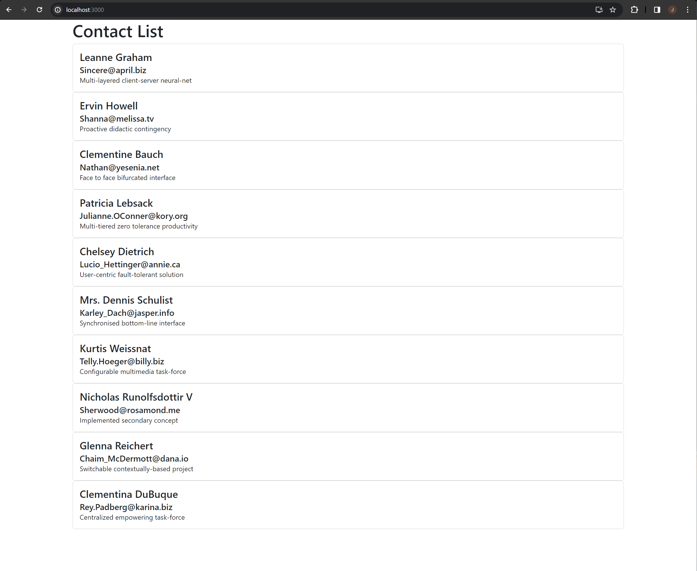

# web603-class-w3d2-group

## Getting Started

### Step 1: Create A React Application
Create the React application by
```bash
$ npx create-react-app group-demo
```
to create the application with root `group-demo/`.

### Step 2: Install Dependencies
Inside `group-demo` (do `cd group-demo` if needed), install Bootstrap by
```bash
$ npm install bootstrap
```

## Brief Walkthrough

1. Check out https://jsonplaceholder.typicode.com/users. This is the data (in JSON) that will be used for the demo.

2. Rewrite `App.js`. Include 3 major functions:
    - `constructor`
    - `componentDidMount`
    - `render`

    where the key state will be the "contacts", which will be read from the link in step 1.

3. Add a file `contacts.js`. Use `"Cards"` from Bootstrap. Based on the JSON data, create a list of "Cards" for `return()`.

## Output
Start the app by running
```bash
$ npm start
```
in the application root. After the application is successfully compiled, you should be able to see the following in `localhost:3000`.


